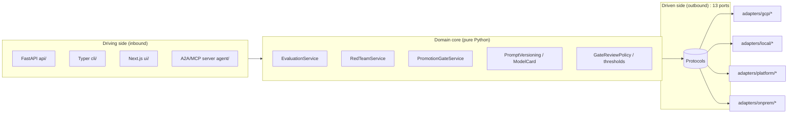
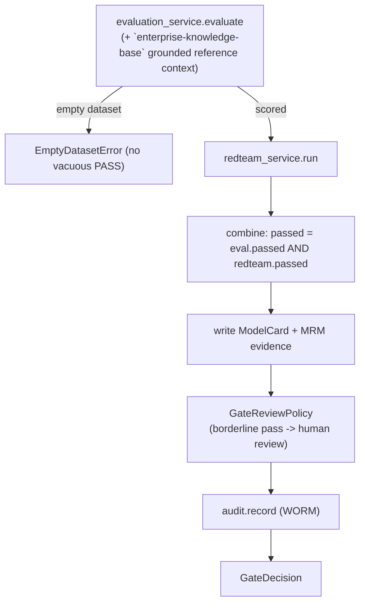
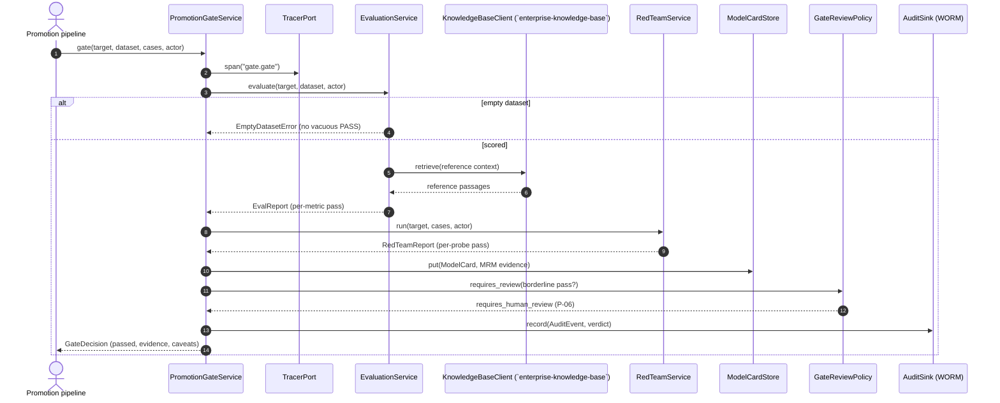
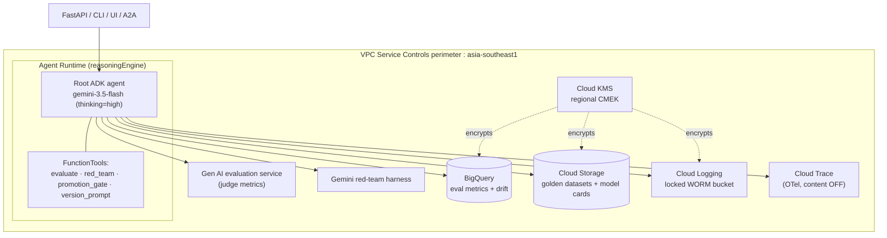

# Architecture : `model-quality-gate` Platform

This document goes deeper than the [README](README.md): the complete port to adapter
table, the gate pipeline as a sequence diagram, the runtime topology on Agent Runtime, and
the relationship to the horizontal-platform dependencies.

The contract layer is authoritative : see [`SPEC.md`](SPEC.md). This file describes how the
pieces fit together; it does not redefine them.

---

## 1. Hexagonal overview

`model-quality-gate` is a **ports-and-adapters** (hexagonal) application. The domain core in
[`src/model_quality_gate/domain/`](src/model_quality_gate/domain/) owns all orchestration and has **no**
dependency on Google Cloud, ADK, FastAPI, or any framework : only the Python standard
library. Everything the domain needs from the outside world is a `typing.Protocol` **port**;
concrete **adapters** are bound to ports by dotted path in
[`config/settings.yaml`](config/settings.yaml) and instantiated lazily by the `Container`
in [`config.py`](src/model_quality_gate/config.py).



The `Container` picks the adapter for the active `profile`
(`gcp` | `local` | `platform` | `onprem`). `platform` is deliberately hybrid: it uses
four explicit sibling/delegate bindings and retains `gcp` for the other ports. Any other
unknown or missing profile fails closed. Because every
adapter constructor is `def __init__(self, settings: Settings) -> None` and **all** Google
Cloud SDK imports are **lazy**, the `local` / test profile imports and runs the whole gate
with **no GCP SDK installed**, and the `onprem` profile imports cleanly to prove migration
parity.

---

## 2. The 13 ports to adapter table

Every port is an `@runtime_checkable` `Protocol` under
[`src/model_quality_gate/ports/`](src/model_quality_gate/ports/). The `gcp` column is the primary
managed-service adapter; the `local` column is a real, deterministic, SDK-free in-process
implementation (the whole gate runs offline on it); the `platform` column (where present)
is a thin HTTP client to a sibling horizontal-platform service; the `onprem` column is a
placeholder stub that **constructs cleanly and satisfies the Protocol** but raises
`NotImplementedError` from every method (the migration target is Google Distributed
Cloud : no third-party product is named).

| # | Port (`Protocol`) | Module | `gcp` adapter | `local` adapter | `platform` adapter | `onprem` placeholder |
|---|-------------------|--------|---------------|-----------------|--------------------|----------------------|
| 1 | `EvaluationPort` | `ports/evaluation.py` | `gcp.genai_eval:GenAiEvalAdapter` | `local.evaluation:LocalDeterministicEvalAdapter` | n/a | `onprem.evaluation:OnPremEvalAdapter` |
| 2 | `RedTeamPort` | `ports/evaluation.py` | `gcp.gemini_redteam:GeminiRedTeamAdapter` | `local.redteam:LocalHeuristicRedTeamAdapter` | n/a | `onprem.redteam:OnPremRedTeamAdapter` |
| 3 | `PromptRegistryPort` | `ports/registry_store.py` | `gcp.bigquery_prompts:BigQueryPromptRegistryAdapter` | `local.prompt_registry:LocalPromptRegistryAdapter` | n/a | `onprem.prompt_registry:OnPremPromptRegistryAdapter` |
| 4 | `ModelCardStorePort` | `ports/registry_store.py` | `gcp.gcs_model_cards:GcsModelCardStoreAdapter` | `local.model_card_store:LocalModelCardStoreAdapter` | n/a | `onprem.model_card_store:OnPremModelCardStoreAdapter` |
| 5 | `MetricsStorePort` | `ports/registry_store.py` | `gcp.bigquery_metrics:BigQueryMetricsStoreAdapter` | `local.metrics_store:LocalMetricsStoreAdapter` | n/a | `onprem.metrics_store:OnPremMetricsStoreAdapter` |
| 6 | `KnowledgeBaseClientPort` | `ports/knowledge.py` | `platform.remote_knowledge_base:RemoteKnowledgeBaseAdapter` | `local.knowledge_base:LocalFtsKnowledgeBaseAdapter` | `platform.remote_knowledge_base:RemoteKnowledgeBaseAdapter` | `onprem.knowledge_base:OnPremKnowledgeBaseAdapter` |
| 7 | `LLMPort` | `ports/generation.py` | `gcp.gemini_llm:GeminiLLMAdapter` | `local.llm:LocalDeterministicLLMAdapter` | n/a | `onprem.llm:OnPremLLMAdapter` |
| 8 | `AuditSinkPort` | `ports/observability.py` | `gcp.cloud_logging_audit:CloudLoggingAuditAdapter` | `local.audit:LocalAppendOnlyAuditAdapter` | `platform.remote_audit:RemoteAuditAdapter` | `onprem.audit:OnPremAuditAdapter` |
| 9 | `ObservabilityTracerPort` | `ports/observability.py` | `gcp.cloud_trace_tracer:CloudTraceTracerAdapter` | `local.tracer:LocalNoopTracerAdapter` | n/a | `onprem.tracer:OnPremTracerAdapter` |
| 10 | `AgentRegistryPort` | `ports/governance.py` | `gcp.a2a_registry:A2ARegistryAdapter` | `local.registry:LocalRegistryAdapter` | `platform.remote_registry:RemoteRegistryAdapter` | `onprem.registry:OnPremRegistryAdapter` |
| 11 | `ToolCatalogPort` | `ports/governance.py` | `gcp.mcp_tool_catalog:McpToolCatalogAdapter` | `local.tool_catalog:LocalToolCatalogAdapter` | n/a | `onprem.tool_catalog:OnPremToolCatalogAdapter` |
| 12 | `DatasetStorePort` | `ports/dataset_store.py` | `gcp.gcs_datasets:GcsDatasetStoreAdapter` | `local.dataset_store:LocalDatasetStoreAdapter` | n/a | `onprem.dataset_store:OnPremDatasetStoreAdapter` |
| 13 | `IdentityPort` | `ports/identity.py` | `gcp.iap_identity:IapIdentityAdapter` | `local.identity:LocalPersonaIdentityAdapter` | `gcp.iap_identity:IapIdentityAdapter` | `onprem.identity:OnPremIdentityAdapter` |

> Under `local`, platform-client ports (`KnowledgeBaseClientPort`, `AgentRegistryPort`) use
> in-process implementations, **not** HTTP to siblings: a laptop runs one app, not the whole
> platform. The `local` path imports no google-cloud package; an optional Firestore
> emulator opt-in (`FIRESTORE_EMULATOR_HOST`) is the only branch that imports a google
> client, lazily.

> Dotted paths above are relative to the `model_quality_gate.adapters` package; the fully-qualified
> bindings are in [`config/settings.yaml`](config/settings.yaml) under `adapters:` and are
> the build contract : **module paths and class names there are fixed**. Four ports have a
> `platform` entry: identity remains IAP-verified while knowledge_base, audit and registry
> delegate to the three sibling platform services `model-quality-gate` depends on.

---

## 3. The gate pipeline

The domain services own orchestration and call only ports. The promotion gate (from
[`SPEC.md`](SPEC.md) §5) combines an evaluation and a red-team run:



> All steps wrapped in `tracer.span`.

As a sequence:



Key invariants:
- **No vacuous PASS** : an empty golden dataset is a hard error; a backend failure yields a
  failing report, not a crash.
- **Both checks combine** : a target passes only if every eval metric clears its threshold
  AND every red-team probe is blocked.
- **Everything audited** : every gate / eval / red-team action writes a WORM `AuditEvent`.
- **Everything inside a span** : but message-content capture is OFF, so spans carry
  structure and token usage, never prompt/response text.

---

## 4. Runtime topology on Agent Runtime

In the `gcp` profile, the ADK agent is hosted on **Agent Runtime** (ex-Agent Engine, a
`reasoningEngine` resource) inside a VPC-SC perimeter in `asia-southeast1`.



- **One region for everything** (`asia-southeast1`); regional endpoints + per-service CMEK
  give the residency guarantee a global endpoint would not.
- **The gate is a promotion-time check**, not an inline request dependency of other agents:
  they call `GET /v1/gate` to confirm a target passed before promoting it (rule R5).

---

## 5. Dependency relationship to the horizontal platform

`model-quality-gate` (catalog `model-quality-gate`, group `hrz`) is a shared platform service that depends on three sibling
services and is itself depended on by every B/C agent (rule R5).

```mermaid
flowchart LR
    subgraph a4["`model-quality-gate` (this repo)"]
        DOMAIN[Domain core]
        KBP[KnowledgeBaseClientPort]
        AUDIT[AuditSinkPort]
        REGP[AgentRegistryPort]
        DOMAIN --> KBP & AUDIT & REGP
    end

    subgraph standalone["profile = gcp (standalone)"]
        BQ[BigQuery + GCS]
        CL[Cloud Logging WORM]
        A2Acard[Local A2A AgentCard]
    end

    subgraph platform["profile = platform (inside the horizontal platform)"]
        `enterprise-knowledge-base`[enterprise-knowledge-base]
        `agent-observability`[agent-observability]
        `agent-registry`[agent-registry]
    end

    KBP -- gcp/platform --> `enterprise-knowledge-base`
    AUDIT -- gcp --> CL
    AUDIT -- platform --> `agent-observability`
    REGP -- gcp --> A2Acard
    REGP -- platform --> `agent-registry`
```

| Dependency | Repo | Backs `model-quality-gate` port | HTTP contract (SPEC §6) |
|------------|------|----------------|-------------------------|
| `enterprise-knowledge-base` | `enterprise-knowledge-base` | `KnowledgeBaseClientPort` | `POST /v1/search` |
| `agent-observability` | `agent-observability` | `AuditSinkPort` (R2) | `POST /v1/audit` |
| `agent-registry` | `agent-registry` | `AgentRegistryPort` (R4) | `POST/GET /v1/agents` |
| **Consumers** | every B/C agent | `model-quality-gate` (R5) | `GET /v1/gate?model=...` |

The `platform` adapters (`adapters/platform/remote_*.py`) are thin HTTP clients whose JSON
field names mirror the domain dataclasses exactly (enums as strings), so swapping from the
direct-GCP adapter to the remote client is a binding change, never a domain change.

---

## 6. Why this shape

- **No vendor lock-in (P-02):** the domain depends on Protocols, not SDKs. The `local`
  adapters prove the domain runs entirely off-cloud, and the on-prem placeholder adapters
  prove interface parity and make the exit path concrete (P-12, see
  [`docs/onprem-migration.md`](docs/onprem-migration.md)).
- **Testable without the cloud:** lazy SDK imports + the real `local` adapter family mean
  the whole suite, and the gate end to end, run under the `local` profile with no Google
  Cloud packages installed.
- **Residency by construction:** one region, regional endpoints, per-service CMEK, VPC-SC.
- **Auditable by construction:** WORM audit of every gate decision, model cards as MRM
  evidence, maker-checker on borderline passes, and a self-eval gate over the gate logic.
