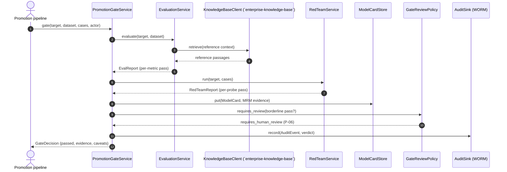
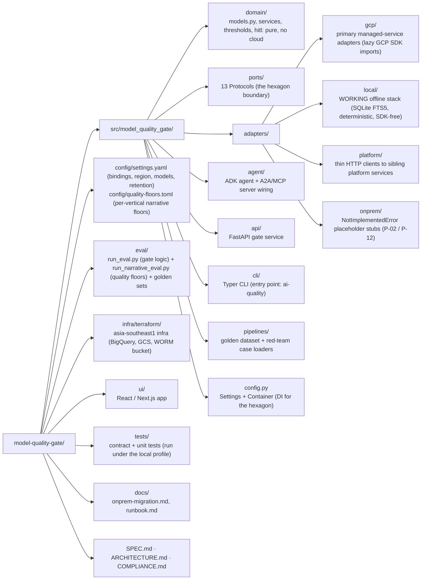

# `model-quality-gate`: AI Quality & Model-Risk Platform

**Industries:** All GenAI; especially regulated (banking, insurance, healthcare / pharma, public sector)

> The production-promotion **eval / red-team gate** and **model-risk (MRM)** evidence
> system for APAC banking. Every B and C agent in the catalog must pass `model-quality-gate` before
> promotion (dependency rule R5). Built ports-and-adapters on the **Gemini Enterprise
> Agent Platform**, with a configurable deployment region defaulting to `asia-southeast1`.

[](LICENSE)
[](pyproject.toml)

> **Reference build, not affiliated with, endorsed by, or sponsored by Google.** This is a
> public engineering portfolio piece. "Gemini Enterprise Agent Platform", "Gen AI
> evaluation service", "BigQuery", "Agent Runtime", and other Google Cloud product names
> are trademarks of Google LLC and are used here only to describe the architecture. No
> warranty; see [`LICENSE`](LICENSE). Do not deploy against live regulated workloads
> without your own legal, security, and model-risk sign-off.

---

## 1. What `model-quality-gate` produces

`model-quality-gate` takes a **target** (a model + a prompt version + a golden dataset) and returns four
artifacts, each with the evidence behind it:

| # | Artifact | Domain type | Service |
|---|----------|-------------|---------|
| 1 | **EvalReport**: per-metric score / threshold / passed | `EvalReport` | `EvaluationService.evaluate()` |
| 2 | **RedTeamReport**: per-probe pass/fail across five attack families | `RedTeamReport` | `RedTeamService.run()` |
| 3 | **GateDecision**: the PASS/FAIL promotion verdict + MRM evidence | `GateDecision` | `PromotionGateService.gate()` |
| 4 | **ModelCard** + **PromptVersion**: versioned MRM evidence | `ModelCard`, `PromptVersion` | `ModelCardService`, `PromptVersioningService` |

A target **passes** iff the EvalReport clears every metric threshold AND the RedTeamReport
blocks every probe. A consuming vertical names its own **metric bundle** (`doc1-cdd-sow` ...
`mkt6-compliance`, `domain/thresholds.py`) so its four-metric gate stays intact, with
per-bundle thresholds; an unrecognised metric/bundle is a hard 422, never a silent PASS.
Golden datasets can be published at runtime (`POST /v1/datasets`, `DatasetStorePort`) or
read from the bundled JSONL. Afterwards, `GET /v1/drift/{model}` and `ai-quality drift`
read a model's recorded quality drift and return a `DriftEscalation`
(`DriftMonitorService`): an `alert` requires a re-gate and a model-risk review, and an
absent measurement escalates rather than reading as calm. It states the requirement and
executes nothing, and the live-traffic sampler behind it is deliberately absent
([runbook](docs/runbook.md#drift-monitoring)). Every non-health route requires a verified service caller
(`api/security.py`; shared-secret in `local`, OIDC in `gcp`). Catalog identity: `model-quality-gate`,
group **`hrz`** (shared platform services), priority **P0**, buyer **Model Risk / MLOps**.
`model-quality-gate` does **not** process customer PII (it evaluates models against datasets), so rule R1 /
`agent-guardrail-gateway` is **N/A**.

Every artifact, metric and decision is a pure-stdlib dataclass in
[`src/model_quality_gate/domain/models.py`](src/model_quality_gate/domain/models.py), the heart of the
hexagon, with **zero** dependency on Google Cloud, ADK, or any framework.

---

## 2. Architecture: the hexagon

The domain core owns all orchestration and speaks only to **ports** (Python `Protocol`s).
Four interchangeable adapter families implement those ports. Switching the entire managed
stack to the offline local one, or to the on-prem migration target, is a **one-line profile
change** (`AI_QUALITY_PROFILE`) with no domain edits, the proof of General Principle
**P-02** (no vendor lock-in).

```mermaid
flowchart TB
    subgraph edges["Driving adapters (inbound)"]
        API["FastAPI gate service<br/>api/"]
        CLI["Typer CLI<br/>cli/"]
        UI["React / Next.js UI<br/>ui/"]
        A2A["A2A / MCP server<br/>agent/"]
    end

    subgraph core["Domain core: pure Python, no GCP imports"]
        direction TB
        MODELS["domain/models.py<br/>(targets, reports, gate, model cards)"]
        SVCS["Services: Evaluation · RedTeam ·<br/>PromotionGate · PromptVersioning ·<br/>ModelCard · GateReviewPolicy"]
        THRESH["domain/thresholds.py"]
        MODELS --- SVCS --- THRESH
    end

    subgraph ports["Ports (13 Protocols): the hexagon boundary"]
        P1["Evaluation · RedTeam"]
        P2["PromptRegistry · ModelCardStore · MetricsStore"]
        P3["KnowledgeBaseClient (`enterprise-knowledge-base`) · LLM judge"]
        P4["AuditSink · Tracer (`agent-observability`)"]
        P5["AgentRegistry (`agent-registry`) · ToolCatalog"]
    end

    subgraph gcp["adapters/gcp/*: primary (managed services)"]
        G["Gen AI evaluation service · Gemini judge ·<br/>BigQuery · Cloud Storage CMEK ·<br/>Cloud Logging WORM · Cloud Trace"]
    end
    subgraph loc["adapters/local/*: WORKING offline stack"]
        LO["SQLite FTS5 retrieval · deterministic scorer ·<br/>heuristic red-team · deterministic judge ·<br/>SQLite stores (SDK-free, no emulator)"]
    end
    subgraph plat["adapters/platform/*: platform-service HTTP clients"]
        PL["`enterprise-knowledge-base` Knowledge Base · `agent-observability` Audit · `agent-registry`"]
    end
    subgraph onp["adapters/onprem/*: placeholder stubs"]
        ON["NotImplementedError stubs that satisfy<br/>the same Protocols (P-02 / P-12 exit story)"]
    end

    edges --> core
    core --> ports
    ports --> gcp
    ports --> loc
    ports --> plat
    ports --> onp
```

- **Driving (inbound) adapters**: the API, CLI, UI, and the A2A/MCP server.
- **Domain core**: services build the four artifacts by composing port calls. It never
  imports a cloud SDK.
- **Ports**: 11 `@runtime_checkable` `typing.Protocol`s under
  [`src/model_quality_gate/ports/`](src/model_quality_gate/ports/).
- **Driven (outbound) adapters**: `gcp` (real SDK calls, lazy imports), `local` (a WORKING
  offline stack: SQLite FTS5 retrieval, deterministic scorer / judge, heuristic red-team,
  SDK-free), `platform` (HTTP clients to the horizontal-platform services), `onprem`
  (placeholder stubs).

See [`ARCHITECTURE.md`](ARCHITECTURE.md) for the full port table, the gate pipeline
sequence diagram, and the runtime topology.

---

## 3. Pinned GCP stack (current GA names, mid-2026)

> Platform note: the product is **Gemini Enterprise Agent Platform**; the API host is
> still `aiplatform.googleapis.com`. Everything is pinned to
> the selected deployment region (default `asia-southeast1`). The authoritative source for
> the stack is [`SPEC.md`](SPEC.md) §3.

| Concern | Service (current name) | Identifier |
|---------|------------------------|------------|
| Agent framework | ADK (Python) | `google-adk==2.7.1` |
| Reasoning / judge model | Gemini 3.5 Flash | `gemini-3.5-flash` (thinking=high) |
| Triage model | Gemini 3.5 Flash | `gemini-3.5-flash` |
| Eval backend | Gen AI evaluation service | `vertexai.Client(...).evals` |
| Red-team harness | Gemini-driven adversarial probes | `google-genai` |
| Eval metrics / drift | BigQuery | `google-cloud-bigquery` |
| Golden datasets / model cards | Cloud Storage (CMEK) | `google-cloud-storage` |
| Run-keyed MRM evidence | Separate retention-locked Cloud Storage bucket; runtime is create/read only | `google-cloud-storage` |
| Audit (WORM) | Cloud Logging locked bucket | retention 2557 days (~7y) |
| Tracing | Cloud Trace via OpenTelemetry | content capture **OFF** |
| Promotion CI | Cloud Build trigger | the P-08 gate |
| Interop | A2A v1.0 + MCP 2026-07-28 | AgentCard `/.well-known/agent-card.json` |
| Sovereignty | VPC-SC, regional CMEK, Org Policy | `asia-southeast1` |

**Gotchas honoured by the build** (SPEC §3): regional endpoints + per-service CMEK for
residency; message-content capture is **OFF** in spans; the locked log bucket is
**irreversible** (retention is a Terraform var); the build **never** uses the floating ADK
default model or `gemini-2.0-flash`.

---

## 4. Quickstart

### 4.1 `local` profile: a WORKING offline gate (no GCP, runs anywhere)

The `local` profile binds every port to a **real, deterministic, SDK-free** in-process
implementation and runs the whole promotion gate end to end with **no Google Cloud, no API
key, and no emulator**. It is the dev / test / CI default. The core dependencies are
framework-light; the GCP SDKs live in the `[gcp]` extra and are never installed here.

```bash
git clone https://github.com/portable-genai/model-quality-gate.git
cd model-quality-gate

python3.12 -m venv .venv && source .venv/bin/activate
pip install -e ".[dev]"          # core + dev tooling, NO google-cloud-* packages

export AI_QUALITY_PROFILE=local
make lint test                   # ruff + mypy + pytest -m 'not integration'
make eval                        # the `model-quality-gate` self-eval gate (gate logic)
make eval-narrative              # narrative quality vs the per-vertical floors
```

Run the **promotion gate end to end offline**. The bundled golden dataset
`compliance-qa-golden` is grounded against a self-seeding local SQLite FTS5 reference
corpus, so the gate produces passing eval + red-team artifacts and a model card. The
overall production-promotion verdict is deliberately FAIL because a laptop cannot
mint managed evaluation attestation:

```bash
make gate-local
# or, explicitly:
AI_QUALITY_PROFILE=local ai-quality gate gemini-3.5-flash v3 compliance-qa-golden
```

Expected (abridged): the EvalReport and RedTeamReport are `PASS`; the Promotion Gate is
`FAIL` with `evaluation passed but is not attested promotion evidence`. `make gate-local`
asserts that fail-closed outcome and exits successfully as a self-test.

The local stores default to `~/.model_quality_gate/*.db`; the tests use in-memory SQLite. The
`local` path imports **no** google-cloud package. Name the profile explicitly (the Makefile
and `ci.yaml` do): leaving `AI_QUALITY_PROFILE` unset binds the same adapters but withholds
the openings `local` is granted, so the guarded routes refuse with a `503` (SPEC §1).

**Optional: higher-fidelity local with the Firestore emulator** (never required). Set
`FIRESTORE_EMULATOR_HOST` and install the `[gcp]` extra and the in-process registry routes
to the Firestore emulator; the google client is imported lazily, only on that branch.
Otherwise the SDK-free SQLite / in-process path is used. There is no emulator for the Gen AI
evaluation service, Gemini, or BigQuery, so those stay on the SDK-free workaround.

Contract tests confirm that the `local` adapters (and the `onprem` placeholder adapters)
satisfy the same 13 Protocols as the GCP adapters (interface parity), and the unit suite
drives the domain services against the real `local` adapters.

### 4.2 `onprem` profile: the fail-fast migration target

The `onprem` profile binds every port to a placeholder adapter that raises
`NotImplementedError`. It exists to prove the **exit / portability** story (P-12): the
on-prem stubs satisfy the same Protocols, and a consequential CLI command fails fast with a
clean exit code 2 naming the migration target.

```bash
export AI_QUALITY_PROFILE=onprem
ai-quality gate gemini-3.5-flash v3 compliance-qa-golden   # exits 2 with the migration message
```

See [`docs/onprem-migration.md`](docs/onprem-migration.md) for the migration checklist.

### 4.3 `gcp` profile: real managed stack in `asia-southeast1`

```bash
pip install -e ".[gcp,dev]"      # adds google-adk, google-genai, bigquery, storage, ...

export GOOGLE_CLOUD_PROJECT=your-sg-project
export AI_QUALITY_PROFILE=gcp                 # always set explicitly; there is no default
export AI_QUALITY_KMS_KEY="projects/.../locations/asia-southeast1/keyRings/.../cryptoKeys/..."
gcloud auth application-default login

make tf-plan                      # review, then terraform apply (see docs/runbook.md)
make run-api                      # FastAPI gate on :8084, profile=gcp
```

Everything is keyed off [`config/settings.yaml`](config/settings.yaml), which resolves
`${ENV_VAR}` tokens at load time. Switching profiles never touches code.

---

## 5. Running the three surfaces

| Surface | Command | Notes |
|---------|---------|-------|
| **API** (FastAPI) | `make run-api` | REST gate + the A2A AgentCard at `/.well-known/agent-card.json`; OpenAPI at `/docs`. Port 8084. |
| **CLI** (Typer) | `ai-quality gate gemini-3.5-flash v3 compliance-qa-golden` | Entry point `ai-quality`. Sub-commands `evaluate`, `redteam`, `gate`, `drift`, `version-prompt`, `serve`, `eval`. |
| **UI** (React / Next.js) | `make run-ui` | Talks to the API; renders the EvalReport, RedTeamReport and GateDecision. |

The CLI runs the **full gate end to end against the `local` profile** with no cloud access,
returning passing quality/red-team artifacts but denying production promotion because the
result is not managed-attested (`make gate-local`). Under `onprem` the eval /
red-team backends are placeholder stubs, so `gate` instead reports a clean profile error
(exit code 2) naming the migration target. The **self-eval gate** (`make eval`) runs fully
offline because it drives the real gate logic with deterministic backends.

---

## 6. The promotion gate (`model-quality-gate` / P-08)

No build in the catalog is promoted without passing `model-quality-gate`. The gate combines two independent
checks and writes the MRM evidence behind the verdict:



```bash
make eval        # runs eval/run_eval.py; non-zero exit fails the gate
```

CI enforces it in the hosted GitHub Actions check.
See [`COMPLIANCE.md`](COMPLIANCE.md) for how this maps to the model-risk principle (P-08).

### 6.1 The narrative-quality floor: degraded, or unfit?

`make eval` checks the gate's DECISION. The other half is the quality of the NARRATIVE a model
writes, which is what a reduced (laptop / on-prem) profile actually loses when it swaps a managed
model for a smaller local one. Quality is scored by this service, a managed control, so the
profile running the weaker model needs its own measurement rather than an adjective standing
where a threshold should be.

[`config/quality-floors.toml`](config/quality-floors.toml) is the missing number. Per vertical it
names a **floor** and a **target**, so a measured narrative lands in one of three bands:

| Band | Meaning |
|---|---|
| `FIT` | at or above the target: full quality |
| `DEGRADED` | below the target, at or above the floor: usable, and visibly worse. Disclose it. |
| `UNFIT` | below the floor: this profile must NOT serve this vertical. Not a caveat. |

```bash
make eval-narrative     # runs eval/run_narrative_eval.py; part of `make check`
```

It runs with **no model server, no network and no credentials**: the judge is a deterministic
offline scorer from `agent-eval-kit`, and `tests/unit/test_narrative_floor.py` proves it by
running the whole check with the socket constructor blocked. A locally served model can be opted
in deliberately, and is never required:

```bash
python eval/run_narrative_eval.py --judge local-model \
    --judge-base-url http://127.0.0.1:8001 --judge-model <model-id>
```

The recorded bands are **calibrated against the judge**, which is why every report names the
judge that produced it. Swapping judges moves the scores: run against a local Gemma model instead
of the offline judge, the managed narratives and the controls land in the same places, but the
reduced narratives score around 0.15 lower, enough to move four of them from DEGRADED to UNFIT.
The run then reports MISMATCH and fails, which is the right answer to "the bar moved" rather than
a defect in either judge. Changing the default judge means recalibrating the table in the same
commit.

The golden set records the band each profile is expected to land in, so the run is a regression
test on the degradation table itself: a profile that quietly got worse fails, and so does one
that quietly got better. On the shipped set the reduced profile is DEGRADED for the CDD, credit
and default verticals and **UNFIT for `mkt6-compliance`**, whose floor is the strictest because
its findings reach customers. That distinction is the reason to have a floor rather than a
disclaimer.

The check cannot go quietly green: every case carries a control narrative written below the floor
whose expectation is forced to UNFIT at load, the recorded table must keep at least one DEGRADED
and one UNFIT row, and the judge itself is proven able to go red per vertical.

---

## 7. Security & residency posture

| Control | How it is enforced |
|---------|--------------------|
| **Region pin** (default `asia-southeast1`) | Every service and SDK call targets `var.region`; Terraform fails fast when it is not in `allowed_regions`. No global endpoints. |
| **VPC Service Controls** | All managed services sit inside a service perimeter so eval metrics, golden datasets, model cards and audit cannot egress. |
| **CMEK** (regional) | Customer-managed Cloud KMS keys encrypt BigQuery, Cloud Storage, and the log bucket (CMEK does not cascade, P-09). |
| **WORM audit** (**P-07**) | `CloudLoggingAuditAdapter` writes every gate / eval / red-team `AuditEvent` to a **locked** Cloud Logging bucket (retention 2557 days, irreversible). |
| **Tracing without content** | Cloud Trace via OpenTelemetry with message-content capture **OFF**: spans carry structure and token usage, never prompt/response text. |
| **Maker-checker** (**P-06**) | `GateReviewPolicy` flags a borderline PASS for a model-risk officer's sign-off. |
| **No vacuous PASS** | An empty golden dataset is a hard error, never a free PASS; a failing backend yields a failing report, never a crash. |
| **Exit / portability** (**P-12**) | `adapters/onprem/*` placeholders + [`docs/onprem-migration.md`](docs/onprem-migration.md) document the migration to Google Distributed Cloud with zero domain changes. |

The complete mapping of **every** General Principle (P-01..P-12) and dependency rule
(R1..R6) to a concrete control in this repo is in [`COMPLIANCE.md`](COMPLIANCE.md).

---

## 8. Platform dependencies

`model-quality-gate` depends on three sibling horizontal-platform services. When deployed standalone, the
`gcp` adapters use BigQuery / Cloud Logging / a local registry; when deployed inside the
full platform, the `platform` adapters delegate over HTTP (contracts in
[`SPEC.md`](SPEC.md) §6).

| Dep | Repo | `model-quality-gate` port it backs | `platform` adapter |
|-----|------|-------------------|--------------------|
| `enterprise-knowledge-base` | `enterprise-knowledge-base` | `KnowledgeBaseClientPort` (grounded eval) | `RemoteKnowledgeBaseAdapter` |
| `agent-observability` | `agent-observability` | `AuditSinkPort` (R2) | `RemoteAuditAdapter` |
| `agent-registry` | `agent-registry` | `AgentRegistryPort` (R4) | `RemoteRegistryAdapter` |

`model-quality-gate` itself satisfies rule **R5**: it is the gate every other agent calls before promotion.

---

## 9. Repository layout



---

## 10. Documentation map

- [`SPEC.md`](SPEC.md): the authoritative build specification (locked decisions, pinned
  stack, adapter convention, gate pipeline, HTTP contracts).
- [`ARCHITECTURE.md`](ARCHITECTURE.md): the 13-port table, the gate sequence, the runtime
  topology, and the platform dependencies.
- [`COMPLIANCE.md`](COMPLIANCE.md): every General Principle and dependency rule mapped to a
  concrete control in this repo.
- [`docs/onprem-migration.md`](docs/onprem-migration.md): the exit/portability checklist.
- [`docs/runbook.md`](docs/runbook.md): deploy, region fail-fast, key rotation, retention.
- [`docs/ADOPTING.md`](docs/ADOPTING.md): consume, extend, or mechanically rename a fork.
- [`docs/faq/README.md`](docs/faq/README.md): role-focused operational and governance FAQs.
- [`CONTRIBUTING.md`](CONTRIBUTING.md): how to set up, lint, test, and contribute.

---

## Cost and latency

Size this system's cost and latency with the shared interactive calculator: [**live**](https://portable-genai.github.io/cost-latency-calculator/calc/calculator.html?system=model-quality-gate) or the [in-repo page](cost-latency-calculator.html). The engine and the pricing book are maintained once in [cost-latency-calculator](https://github.com/portable-genai/cost-latency-calculator).

## License

Apache-2.0 © 2026 Ashish Awasthi. See [`LICENSE`](LICENSE).

> Again: this is an independent reference build and is **not affiliated with, endorsed by,
> or sponsored by Google LLC**. Google Cloud product names are used descriptively only.
