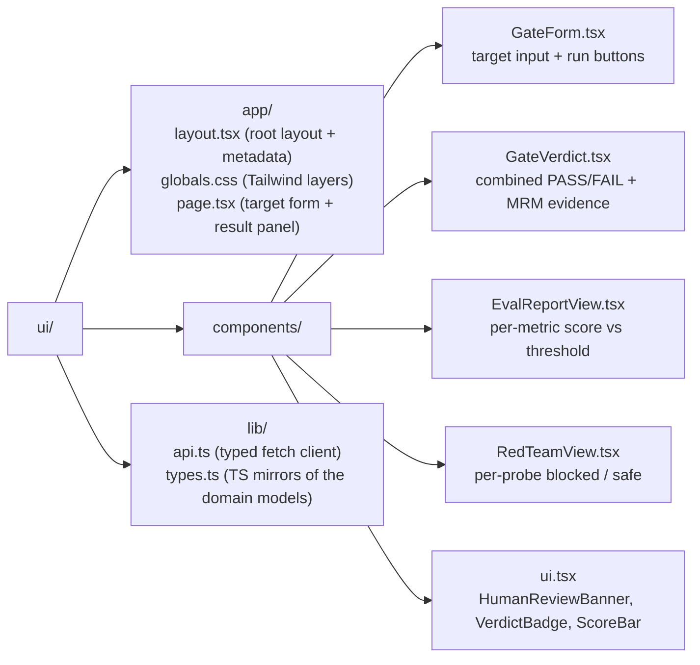

# `model-quality-gate` Platform : Demo UI

A banking-grade demo console for `model-quality-gate`, the production-promotion eval / red-team gate and
model-risk (MRM) evidence system. It is a thin presentation layer over the `model-quality-gate` FastAPI
backend: it renders the EvalReport, the RedTeamReport, and the PASS/FAIL GateDecision with
its MRM evidence, and surfaces the maker-checker banner for a borderline pass.

Built with **Next.js (App Router) + TypeScript + Tailwind**. Dependencies are kept minimal:
`next`, `react`, `react-dom`, `tailwindcss`, `postcss`, `autoprefixer`, `typescript`, and
the `@types` packages, nothing else.

## What it shows

- **Target form**: choose a model + prompt version + golden dataset id, then run the full
  promotion gate, the evaluation only, or the red-team harness only.
- **Eval report**: per-metric score versus threshold (with a threshold marker), and the
  overall PASS/FAIL.
- **Red-team report**: per-probe blocked / not-blocked and safe / unsafe across the five
  attack families (prompt injection, jailbreak, PII exfiltration, harmful content,
  hallucination).
- **Gate verdict**: the combined PASS/FAIL, the model-card and MRM-evidence pointers, the
  caveats, and a prominent **Human review required** banner when the pass is borderline
  (maker-checker, P-06).
- **Health pill**: the active profile and pinned region, polled from `/healthz`.

## Prerequisites

- Node.js 18.18+ (tested on Node 20/22)
- The `model-quality-gate` FastAPI backend running and reachable (default `http://localhost:8084`)

## Configure

```bash
cp .env.local.example .env.local
# edit .env.local if your backend is not on http://localhost:8084
```

If unset, the UI falls back to `http://localhost:8084`. The current health is shown in the
top bar.

## Run

```bash
npm install
npm run dev      # http://localhost:3000
```

Production build:

```bash
npm install
npm run build
npm run start
```

## Backend contract

The typed client (`lib/api.ts`) and TS mirrors (`lib/types.ts`) follow the domain
dataclasses in `src/model_quality_gate/domain/models.py`, serialised per the
`domain/serialization.to_jsonable` convention (SPEC §5): dataclass field names are preserved
(snake_case) and every enum is rendered as its `.value` string.

Endpoints consumed:

- `POST /v1/evaluations` `{ target, dataset_id }` -> `EvalReport`
- `POST /v1/redteam` `{ target }` -> `RedTeamReport`
- `POST /v1/gate` `{ target, dataset_id }` -> `GateDecision`
- `GET /v1/personas` -> seeded dev personas (local profile only; the picker source)
- `GET /healthz` -> `{ status, profile, region }`

The audit actor is never a request field: it is the server-verified identity (see
[`../docs/embedding-and-identity.md`](../docs/embedding-and-identity.md)). In local mode the
client attaches an `X-Dev-Persona` header chosen in the persona picker; in secure mode the
identity comes from the IAP-verified assertion the platform injects.

## Project layout



## Notes

- Pure presentation: no secrets, no direct cloud calls. All data comes from the `model-quality-gate` backend
  over the documented routes.
- Region/branding reflects runtime deployment configuration (default `asia-southeast1`).
- The UI is delivered as **source only**: do not commit `.next/` or `node_modules/` (both
  are gitignored).
